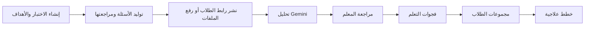
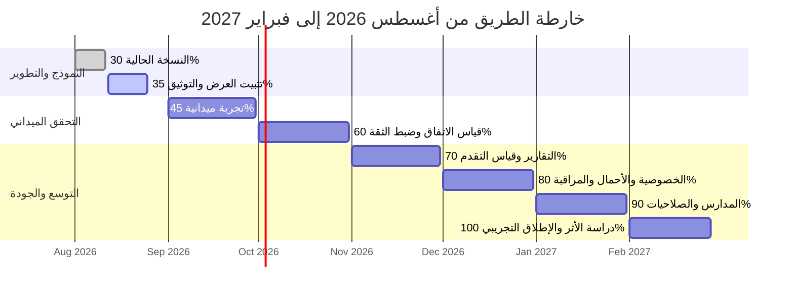

<div align="center" dir="rtl">
  <a href="https://docs.google.com/file/d/1FfwwsZuO5wFZ737icPwInNU3py0EwjPg/preview">
    
  </a>
  <h1>بيّن</h1>
  <p><strong>من إجابة الطالب إلى قرار علاجي موثوق</strong></p>
  <p><a href="https://docs.google.com/file/d/1FfwwsZuO5wFZ737icPwInNU3py0EwjPg/preview"><strong>▶ مشاهدة الفيديو التوضيحي</strong></a></p>
  <p><strong>30% مكتمل</strong> · 70% ضمن خارطة الطريق</p>
  <p><sub>آخر تحديث: 11 أغسطس 2026</sub></p>
  <p>
    <a href="#أبرز-الخصائص">الخصائص</a> ·
    <a href="#مسار-العمل-المنفذ">مسار العمل</a> ·
    <a href="#خارطة-التقدم-التراكمي">خارطة التقدم</a> ·
    <a href="#التقنيات-المستخدمة">التقنيات</a> ·
    <a href="#التشغيل-المحلي">التشغيل المحلي</a>
  </p>
</div>

---

«بيّن» منصة عربية تساعد المعلم على إنشاء اختبار تشخيصي، جمع إجابات الطلاب، تحليلها عبر Gemini، مراجعة الحالات منخفضة الثقة، ثم عرض فجوات التعلم والمجموعات والخطط العلاجية.

> **ما المقصود بالحالات منخفضة الثقة؟** هي الإجابات التي تكون درجة ثقة النظام في تحليلها أقل من الحد المعتمد، مثل الإجابات غير الواضحة أو الخط اليدوي غير المقروء أو الصور ضعيفة الجودة. لا يعتمدها النظام تلقائيًا، بل يعرضها للمعلم لمراجعتها واتخاذ القرار.

## أبرز الخصائص

- واجهة عربية متجاوبة للمعلم والطالب.
- إنشاء اختبار من 5 إلى 10 أسئلة وربطه بأهداف تعلم.
- توليد مسودة أسئلة عبر Gemini مع مراجعة المعلم قبل النشر.
- نموذج رقمي عام يجمع عددًا غير محدود من الإجابات، مع مسار بديل لملفات PDF والصور.
- تحليل الإجابات، عرض تقدم التشغيل، وتسجيل النتائج في PostgreSQL.
- قائمة مراجعة بشرية للحالات منخفضة الثقة: تأكيد الاقتراح أو تصنيف الإجابة غير المقروءة.
- استخراج فجوات التعلم وتجميع الطلاب في مجموعات مرنة.
- إنشاء خطط علاجية قابلة للتحرير والحفظ والاعتماد والطباعة.

## مسار العمل المنفذ



<h2 dir="rtl">خارطة التقدم التراكمي</h2>

<table dir="rtl">
  <thead>
    <tr>
      <th>المرحلة</th>
      <th>الأعمال المستهدفة</th>
      <th>الإنجاز التراكمي</th>
    </tr>
  </thead>
  <tbody>
    <tr><td><strong>الوضع الحالي — 11 أغسطس 2026</strong></td><td>نموذج أولي متكامل، واجهة عربية، توليد أسئلة، جمع إجابات، تحليل، مراجعة بشرية، فجوات، مجموعات وخطط</td><td><strong>30%</strong></td></tr>
    <tr><td><strong>12–25 أغسطس 2026</strong></td><td>تثبيت نسخة العرض، نشر GitHub، تسجيل فيديو، جمع 50–100 إجابة مجهولة الهوية بمشاركة معلمين، وتوثيق زمن العمل اليدوي للمقارنة</td><td><strong>35%</strong></td></tr>
    <tr><td><strong>سبتمبر 2026</strong></td><td>تجربة ميدانية مع 3 معلمين و3 مواد وجمع 150 إجابة على الأقل، مع إعداد دليل موحد لتوسيم الإجابات</td><td><strong>45%</strong></td></tr>
    <tr><td><strong>أكتوبر 2026</strong></td><td>تقييم مزدوج لعينة 20%، قياس اتفاق النظام مع المعلمين، ضبط حدود الثقة، وتحسين قراءة الخط والصور</td><td><strong>60%</strong></td></tr>
    <tr><td><strong>نوفمبر 2026</strong></td><td>تقارير PDF/CSV، مكتبة تدخلات علاجية قابلة لإعادة الاستخدام، ولوحة تقارن التقدم قبل العلاج وبعده</td><td><strong>70%</strong></td></tr>
    <tr><td><strong>ديسمبر 2026</strong></td><td>مراجعة الخصوصية والأمن، سياسات الاحتفاظ والحذف، اختبار الوصول، الأحمال، التكلفة، والمراقبة السحابية</td><td><strong>80%</strong></td></tr>
    <tr><td><strong>يناير 2027</strong></td><td>دعم عدة مدارس، صلاحيات المعلم والمشرف، واجهات تكامل، تحسين الجوال، وإدارة مؤسسية للبيانات</td><td><strong>90%</strong></td></tr>
    <tr><td><strong>فبراير 2027</strong></td><td>دراسة أثر ميدانية، تدريب المستخدمين، نموذج استدامة، إطلاق تجريبي عام، وتقرير النتائج النهائية</td><td><strong>100%</strong></td></tr>
  </tbody>
</table>

<br clear="all" />



## نمط التحليل

نسخة الإنتاج تستخدم Gemini صراحةً:

```env
ANALYZER_BACKEND=ai-sdk
AI_ANALYZER_MODE=gemini
AI_MODEL=gemini-3.6-flash
GOOGLE_GENERATIVE_AI_API_KEY=YOUR_API_KEY_HERE
```

## التقنيات المستخدمة

### اللغات البرمجية

- TypeScript
- SQL
- HTML/CSS

### الأطر التقنية

- Next.js 16
- React 19
- AI SDK 7
- Google Gemini
- Prisma
- Zod
- Better Auth

### الأدوات البرمجية

- PostgreSQL
- Redis
- BullMQ
- Docker
- Git
- GitHub
- Vitest
- Playwright

## التشغيل المحلي

### المتطلبات

- Node.js 24.19.0
- pnpm 11.17.0
- Docker Desktop

### الخطوات

```powershell
pnpm install --frozen-lockfile
Copy-Item .env.example .env
pnpm infra:up
pnpm db:deploy
pnpm db:seed
pnpm dev
```

بعد اكتمال التهيئة، افتح `http://localhost:3000/ar/login` للوصول إلى صفحة تسجيل الدخول.
لا يتضمن هذا المستند أي بيانات دخول؛ استخدم حسابًا محليًا مخصصًا لبيئة التطوير.

## الخدمات المحلية

| الخدمة | العنوان |
|---|---|
| تطبيق Next.js | `http://localhost:3000` |
| محرك AI SDK | `http://localhost:8020/health` |
| PostgreSQL | `localhost:54329` |
| Redis | `localhost:63799` |

## الأمان والخصوصية في النموذج الحالي

- ملف `.env` مستبعد من Git، ولا تُحفظ مفاتيح المزود داخل المستودع.
- لا تدخل أسماء الطلاب في مفاتيح التخزين؛ تستخدم معرفات داخلية.

## التحقق من الجودة

```bash
pnpm lint
pnpm typecheck
pnpm test
pnpm build
pnpm test:e2e
```

تغطي الاختبارات الحالية العقود، معالجة الأسماء، الرسم، مواءمة نافس، منطق المحلل، وتدفق الدخول والحماية الأساسي على سطح المكتب والجوال.
